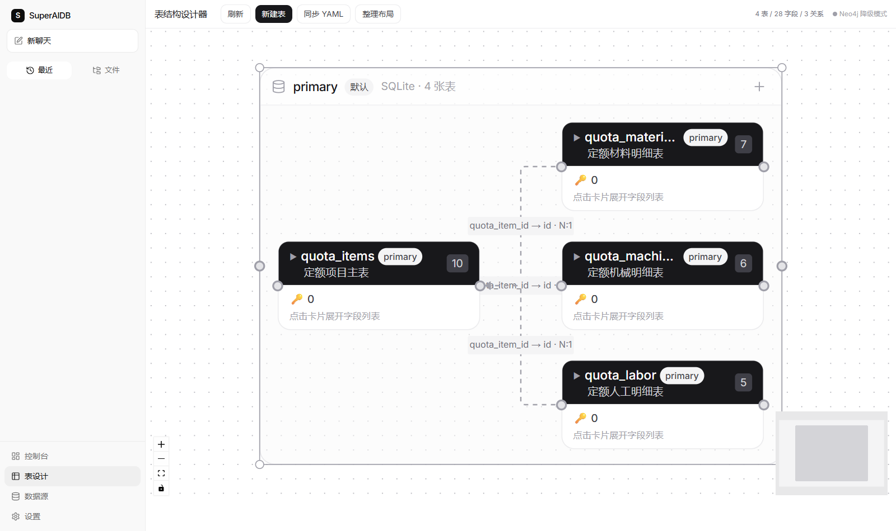
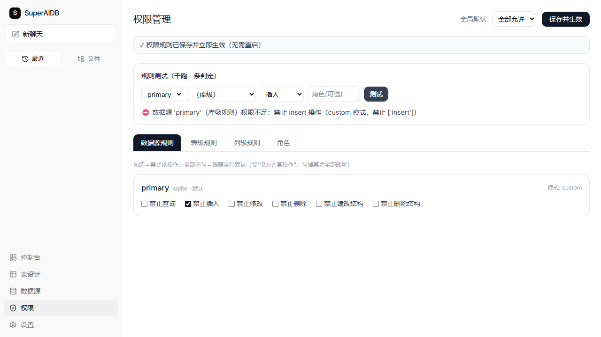

# SuperAIDB

[](LICENSE)
[](https://www.python.org/)
[](data-engine/mcp_server.py)
[](https://github.com/JackeyLove1225/SuperAIDB/actions/workflows/ci.yml)

对话式 AI 数据库 Agent：把文件（Excel / PDF / Word / 图片扫描件）变成可查询的结构化数据库，用自然语言完成增删改查、跨库联邦查询与文档检索。行业差异（术语、Prompt、Schema 模板）全部以配置形式放在 `industries/` 下，**换行业不改代码**。

> 项目源于工程造价行业的真实痛点：PDF 扫描件（定额、清单）人工录入数据库效率极低——为此构建了完整的 OCR 解析入库与自然语言查询产品。仓内工程造价行业包仅作示例与回归夹具；产品面向通用能力，任何行业都可按同格式自建本行业库。

## 产品截图

表结构设计器（工程造价定额库：4 表 / 28 字段 / 3 关系，自动识别主外键并可视化）：



细粒度权限管理（库/表/列/角色四级控权，保存即生效，规则可干跑预演）：



> 对话交互不设固定前端——由上层 MCP 客户端（Reasonix / Kimi Code / Claude Code 等）承载，见下方架构说明。

## 仓库布局

本仓库为单仓库（monorepo）快照，两个子项目：

```
data-engine/      # 产品核心：MCP 能力面 + 38 原子工具 + 契约安全层 + 管理 API（详见其 README）
agent-chat-ui/    # Web 管理控制台（Next.js）：Schema 设计器/数据源/权限/行业管理
```

## 架构（2026-08：能力面 MCP 化）

```
途径一：Web 应用（对人）
  agent-chat-ui 前端 :3000（Next.js）
        │
        ▼
  Management API :2025（FastAPI，X-API-Key 认证 + RBAC）
        │
途径二：MCP 能力面（对 AI）
  上层 AI（Reasonix / Kimi Code / Claude Code 等任何 MCP 客户端）
        │  MCP stdio
        ▼
  mcp_server.py —— 全部数据能力经 MCP 协议暴露，高危操作双层人审
        │
        ▼  两条途径共用同一能力内核
  agent/tools/ —— 38 个原子工具（按域分包）+ 决策树路由（简单指令不依赖 AI 也可执行）
        │
        ▼
  core/contract —— 安全契约层（标识符白名单 / SQL 注入防护 / 主键约束 / 参数化）
        │
        ▼
  core/drivers —— SQLite（默认）/ MySQL / 联邦驱动（跨库 JOIN 与聚合）
        │
  core/vector_store（Chroma 文档 RAG）· core/parser（Excel/PDF/Word/OCR 解析入库）
        │
        ▼
  industries/ —— 行业配置即代码（Schema YAML + 字段 + Prompt + 术语映射）
```


## 功能特性

- **自然语言管数**：意图理解 → 子任务拆解 → 工具执行 → 综合答复，支持多轮对话上下文引用
- **38 个原子工具**：表/记录/字段/外键/索引/统计/导入导出等，全部经契约层安全校验
- **MCP 能力面**：全部工具经 MCP stdio 暴露给任意上层 AI；工具描述自带风险级标注（记录级写/结构变更/管理/文件）
- **文件解析入库**：Excel / PDF / Word / 图片（PaddleOCR）解析为结构化数据写入数据库
- **文档 RAG**：上传文档入 Chroma 向量库，回答文档内容类问题
- **多数据源联邦查询**：`config/datasources.yml` 注册多个数据源，支持跨库 JOIN 与聚合
- **行业配置即代码**：新增行业 = 新增 `industries/` 目录。仓内 `construction_engineering` 仅作示例与回归夹具——产品面向通用能力，各行业用户按同格式自建本行业库
- **表关系可视化**：嵌入式图库（Ladybug，进程内）存储 Schema 图，无需外部图数据库服务
- **Web 管理控制台**：数据源、Schema、行业、权限、系统设置可视化管理

## 安全设计（能力边界即安全边界）

- **契约层强制校验**：所有写操作经标识符白名单、SQL 注入防护、值参数化；系统表删除永久拦截
- **MCP 通道 fail-closed**：无用户上下文，默认 `readonly` 身份；`MCP_ROLE` 显式配置才获得写权限
- **sudo 提权 + 人审闸**：AI 需管理员权限时经 `escalate_permission` 申请，人审批准后临时提权；高危工具挂起表 token 一次性、10 分钟有期、fail-closed；token 不回传 AI 通道，结算只在管理端审批中心（防 AI 自助人审）
- **双层人审纵深**：上层 AI 侧审批卡（配置层）+ 本进程高危闸（代码层），缺一不放行
- **RBAC 权限体系**：用户级专属角色，支持表/列级细粒度权限；管理端点仅限 admin
- **全量安全测试**：SQL 注入/权限矩阵/认证/加密边界/daemon 隔离/人审双通道均有专项回归层，CI 每个 push 真跑

## 技术栈

- **语言**：Python 3.13（Windows；启动脚本为 .bat）
- **AI 接入**：OpenAI 兼容 API（默认 DeepSeek），角色化模型配置（`config/llm_roles.yml`）
- **MCP**：mcp python-sdk ≥ 1.29（`mcp_server.py`，stdio 传输）
- **管理 API**：FastAPI + Uvicorn
- **数据库**：SQLite（默认）/ MySQL；嵌入式图库 Ladybug（Schema 图）
- **向量库**：Chroma
- **文件解析**：openpyxl / PyMuPDF / python-docx / PaddleOCR，LibreOffice（可选，Office 预览）
- **前端**：同仓库 [`agent-chat-ui/`](agent-chat-ui)（Next.js，pnpm）

## 快速开始

### 1. 安装依赖

```bash
pip install -r data-engine/requirements.txt
```

### 2. 配置环境变量

```bash
cp data-engine/config/.env.example data-engine/config/.env
```

`data-engine/config/.env.example` 内有分组注释（33+ 个键），最少需要填：

| 键 | 说明 |
|---|---|
| `AI_API_KEY` | AI 接口密钥（必填，默认 DeepSeek） |
| `AI_BASE_URL` / `AI_MODEL` | 接口地址 / 模型名（默认 `https://api.deepseek.com` / `deepseek-chat`） |
| `DB_TYPE` | `sqlite`（默认）或 `mysql` |
| `INDUSTRY` | 行业模式：`construction_engineering`（内置定额库 Schema 包） |
| `API_KEY_ENABLED` / `API_KEY` | 部署到服务器时开启 Management API 的 X-API-Key 认证 |
| `MCP_ROLE` | MCP 通道身份：`readonly`（默认，只读）/ `user` / `admin` |

多数据源（联邦查询）在 `data-engine/config/datasources.yml` 注册。

### 3. 启动 Web 应用

**一键启动（推荐）**：

```bat
cd data-engine && start_web.bat
```

launcher 并行拉起 Management API（:2025）→ 前端（:3000），自动打开浏览器，带系统托盘图标。`start.bat` 为控制台调试模式；`stop.bat` 停止全部服务。

手动启动：

```bash
# 终端 1：Management API
cd data-engine && python -m uvicorn agent.management.server:mgmt_app --port 2025 --host 127.0.0.1

# 终端 2：前端
cd agent-chat-ui && pnpm dev
```

启动后：管理与可视化控制台 http://localhost:3000 ，API 文档 http://localhost:2025/docs 。

### 4. 接入上层 AI（MCP 方式）

在任何 MCP 客户端中注册本引擎，以 Reasonix 配置为例：

```toml
[[plugins]]
name = "data-engine"
command = "python"
args = ["<本仓库绝对路径>/data-engine/mcp_server.py"]
```

上层 AI 即可获得 37 个数据工具（占位工具 unsupported_op 除外）；高危写操作会触发人审闸，批准后才执行。

## 测试

```bash
cd data-engine
python tests/run_all.py --quick    # 29 个离线测试层（CI 用，无需外部服务/AI Key）
python tests/run_all.py --list     # 列出所有测试层
```

离线层覆盖：编译检查、工具注册与路由、Excel 解析、联邦数据库、Schema 一致性、SQL 注入安全、权限与认证全链路、MCP 能力面与人审双通道等。

## 项目结构

`data-engine/`（产品核心）内部结构：

```
agent/          # 编排层：open_layer（意图理解/任务拆解/执行/综合）、decision_tree、
                #   tools/（38 工具注册，按域分包）、management/（FastAPI 管理 API + launcher）
core/           # 引擎层（不含业务）：drivers/（29 个原子接口，含事务）、contract/（安全契约）、
                #   parser/（文件解析）、federation/（联邦查询）、vector_store/（RAG）、
                #   permission/（RBAC + sudo 提权）
industries/     # 行业配置即代码（construction_engineering 为示例与回归夹具，行业库由用户自建）
mcp_server.py   # MCP 能力面入口（stdio，对上层 AI 暴露全部工具）
reasonix.toml   # Reasonix 客户端集成示例：权限边界 deny 规则 + MCP 插件注册
tests/          # 31 层回归测试（--quick 跑 29 个离线层，CI 门禁）
docs/           # 文档（testing/ 测试清单与报告、demo/ 产品截图）
scripts/        # 部署与运维脚本（debug/ 为开发期调试探针）
```

## 许可与权属

本项目著作权归 **陈龙（JackeyLove1225）** 所有，采用**双轨授权（Dual Licensing）**（见 [LICENSE](LICENSE)）：

- 📖 **AGPL v3（社区轨）**：允许个人学习、评估与开源社区使用；基于本项目构建并对外提供服务（含 SaaS）的衍生作品，须以 AGPL v3 公开完整源代码
- 💼 **商业授权（企业轨）**：如需闭源商用、生产部署或集成进商业产品，请联系作者购买商业授权 → Jackeylove1225@163.com

本仓库为开源发布版本；日常迭代在私有开发仓库持续进行。
